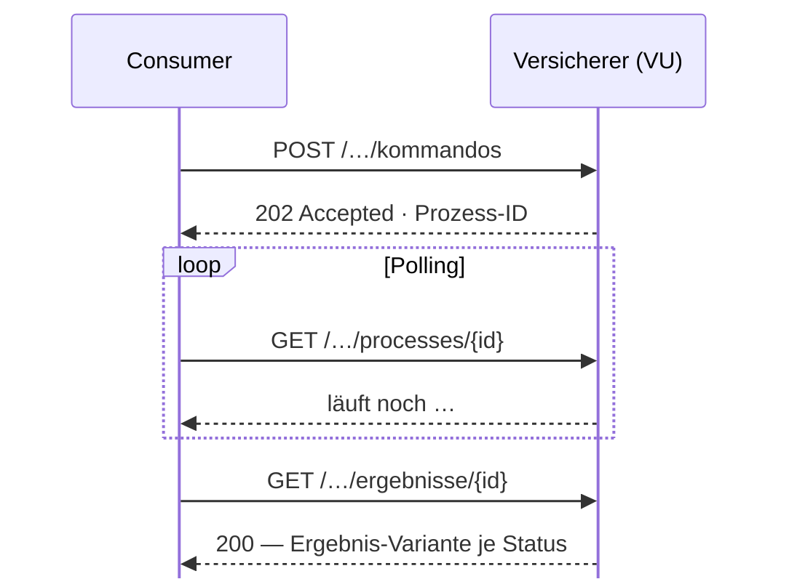
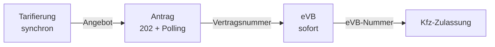

# BiPRO RNext — OpenAPI-Schnittstellen, die LLM-Agents verstehen

Vom generischen SOAP-Objektbaum zu klaren Strukturen und klarem Datenfluss

<div class="mt-8 text-sm opacity-60">

Zielgruppe: Dev- und Architektur-Runde — BiPRO-Vorwissen nicht erforderlich

</div>

<!--
- Es geht um einen konkreten Vorschlag: herstellerneutrale RNext-Referenz-APIs als Soll-Bild für Versicherer.
- Die Norm selbst ist geschützt — alle Beispiele hier sind nachempfunden, keine Original-Inhalte.
- Roter Faden: Was macht eine Schnittstelle maschinen-erschließbar?
-->

---
layout: center
hideInToc: true
---

# Kurzfassung

<div class="text-left mt-8 max-w-3xl mx-auto space-y-4">

1. **RClassic-Schemas sagen fast nichts aus.** Beinahe jedes Feld ist optional, Request und Response teilen denselben Objektbaum — das Wissen steckt in Prosa und Domänenerfahrung.
2. **RNext kann das Schema zur Wahrheit machen.** Schema-valide = fachlich verarbeitbar: strikte Pflichtfelder, Fallunterscheidungen im Typsystem.
3. **In ≠ Out.** Getrennte Eingabe- und Ausgabe-Objekte; berechnete Werte existieren nur in der Antwort. Der Datenfluss steht in der Spezifikation, nicht im Kopf.
4. **Genau das macht die Norm für LLM-Agents erschließbar** — Requests bauen, Antworten prüfen, Tests generieren: ohne spekulative Allgemeinheit, die erst durch Domänenwissen gefüllt werden muss.

</div>

<!--
- Diese vier Thesen sind der Vortrag. Am Ende kommen sie belegt zurück.
-->

---
hideInToc: true
---

# Inhalt

<Toc mode="all" minDepth="1" maxDepth="1" columns="2" listClass="!list-none !pl-0" />

---
layout: section
---

# 1. BiPRO als Rahmen

Normen, Rollen und der Status quo mit RClassic

---
hideInToc: true
---

# BiPRO in drei Minuten

<div class="grid grid-cols-2 gap-8 mt-4">
<div>

### Rollen & Begriffe

- **Consumer** (Vermittler, Makler, Portale) sprechen mit **Providern** (Versicherer, „VU")
- **TAA** = Tarifierung · Angebot · Antrag — der Weg zum Vertrag
- **GeVo** = Geschäftsvorgang, jeder fachliche Vorgang trägt einen Code
- **eVB** = elektronische Versicherungsbestätigung (Kfz-Zulassung)

</div>
<div>

### Normen in diesem Vortrag

<BadgeRow class="mt-2" :badges="[
  { label: 'Norm 423 — TAA Kraftfahrt', tone: 'info' },
  { label: 'Norm 460 — eVB', tone: 'info' },
  { label: 'Norm 502 — Vertragspflege & -beendigung', tone: 'info' },
  { label: 'Norm 502.1 — Vertragsänderung Kfz', tone: 'info' },
]" />

<Callout tone="warning" dense class="mt-4">

Die BiPRO-Normen sind **geschützt**. Dieser Vortrag zeigt Struktur und Muster — keine Norm-Inhalte, alle Snippets sind nachempfunden.

</Callout>

</div>
</div>

<!--
- BiPRO e.V. = Brancheninitiative der deutschen Versicherungswirtschaft, standardisiert die Prozesse zwischen Vermittlern und Versicherern.
- RNext folgt den Design-Konventionen der Norm 102 — REST/JSON/OpenAPI statt SOAP.
- Wir bleiben im Kfz-Umfeld: Tarifierung bis Vertragsbeendigung.
-->

---
hideInToc: true
---

# Status quo: RClassic (SOAP)

<div class="mt-6 space-y-3 text-[17px]">

- Ein Release-Paket: **1.462 Dateien / 126 MB** — 84 zentrale XSD-Schemas, 24 Service-WSDLs, dazu ~40 Norm-PDFs
- Authentifizierung über einen **eigenen SecurityTokenService** (Benutzer/Passwort oder SAML 2.0, WS-Trust)
- Seit vielen Jahren etabliert und flächendeckend im Markt — **es funktioniert**

</div>

<Callout tone="info" class="mt-8">

Das Problem ist nicht die Funktion. Das Problem ist die **Erschließbarkeit**: Wie viel muss man _wissen_, was nicht in den Dateien steht?

</Callout>

<!--
- Zahlen aus einem aktuellen RClassic-Release-Paket (2.10.x) — nur Statistik, keine Inhalte.
- Die PDFs tragen die eigentliche Semantik; die Schemas sind bewusst offen gehalten.
- Überleitung: genau diese Offenheit schauen wir uns jetzt an.
-->

---
layout: section
---

# 2. Spekulative Allgemeinheit

Warum generische Schemas niemandem helfen — Mensch wie Maschine

---
hideInToc: true
---

# Fast alles ist optional

<OptionalityBars />

<!--
- Kennzahlen per Skript über die XSDs eines Release-Pakets gezählt — aggregierte Statistik.
- minOccurs=0 heißt: Der Parser winkt alles durch, die fachliche Prüfung passiert erst tief in der Geschäftslogik des VU.
- Der XSD-Standard KANN Pflichtfelder — sie werden nur nicht genutzt, weil ein Schema viele Sparten und Vorgänge zugleich bedienen muss. Genau das ist die spekulative Allgemeinheit.
-->

---
hideInToc: true
---

# So sieht das aus — nachempfunden

```xml
<complexType name="Person">
  <sequence>
    <element name="Vorname"      type="Name"    minOccurs="0"/>
    <element name="Nachname"     type="Name"    minOccurs="0"/>
    <element name="Geburtsdatum" type="Datum"   minOccurs="0"/>
    <element name="Anschrift"    type="Adresse" minOccurs="0" maxOccurs="unbounded"/>
    <element name="Bankdaten"    type="Konto"   minOccurs="0" maxOccurs="unbounded"/>
    <!-- … 30 weitere optionale Elemente … -->
    <element name="Zusatzdaten"  type="Erweiterung" minOccurs="0" maxOccurs="unbounded"/>
  </sequence>
</complexType>
```

<div class="mt-4 space-y-2 text-[15px]">

- Was ist eine **gültige** Person? Das Schema beantwortet es nicht.
- Bedingte Pflichten („bei Lastschrift braucht es Bankdaten") existieren **nur in Prosa**.
- Generische **Erweiterungshaken** statt typsicherer Struktur.

</div>

<div class="mt-3 text-xs opacity-50"><em>Beispiel nachempfunden — bewusst nicht die Original-Norm.</em></div>

<!--
- Das reale Vorbild hat 36 Felder, 35 davon optional.
- Wer entscheidet, welche Felder ein konkreter Geschäftsvorgang braucht? Der Mensch mit der PDF-Norm und Erfahrung.
-->

---
hideInToc: true
---

# Ein Baum für Anfrage und Antwort

<SharedTreeProblem class="mt-2" />

<!--
- Real: Der Tarifierungs-Request VERLANGT den Baum (1..1), die Response macht ihn optional (0..1) — dieselbe Typstruktur, völlig asymmetrische Semantik.
- Welche Felder fülle ich, welche kommen berechnet zurück? Im Schema unsichtbar.
- Für einen Menschen: Einarbeitungszeit. Für einen LLM-Agent: Halluzinationsfläche.
-->

---
hideInToc: true
---

# Konsequenz: Werkzeuge raten, Menschen wissen

<div class="grid grid-cols-2 gap-8 mt-4">
<div>

### Klassisches Tooling

- Codegen erzeugt **Optional-Wüsten** — jeder Zugriff ein Null-Check
- Validierung erst **zur Laufzeit beim VU**, nicht beim Bauen des Requests
- Jede Integration braucht die **Norm-Expertin** mit PDF und Erfahrung

</div>
<div>

### LLM-Agents

- Aus dem Schema lassen sich **keine gültigen Requests** konstruieren
- Antworten lassen sich **nicht gegen Garantien prüfen**
- Der Agent produziert **plausible, aber falsche** Feldkombinationen

</div>
</div>

<Callout tone="warning" class="mt-6">

**Spekulative Allgemeinheit:** Das Schema hält alles offen — und verlagert die Wahrheit in Domänenwissen. Für Maschinen (und neue Teammitglieder) ist das die teuerste Eigenschaft.

</Callout>

<!--
- „Spekulative Allgemeinheit" nach Fowler/Refactoring: Flexibilität für Fälle, die nie eintreten — bezahlt mit Unklarheit im Hier und Jetzt.
- Überleitung: Der RNext-Vorschlag dreht genau diese Schraube um.
-->

---
layout: section
---

# 3. Der RNext-Vorschlag: Bausteine

Pflichtfelder, In/Out-Trennung, Varianten, Fehler, Auth, Traceability

---
hideInToc: true
---

# Der Vorschlag im Überblick

<div class="mt-4 text-[15px]">

| API-Säule                 | Norm      | Operationen | Schemas | Modus              |
| ------------------------- | --------- | ----------: | ------: | ------------------ |
| Tarifierung               | 423       |           4 |      75 | rein synchron      |
| Antrag & eVB              | 423 · 460 |          12 |      85 | sync + 202/Polling |
| Vertragspartner & Zahlung | 502       |           7 |      55 | 201/202 hybrid     |
| Vertragsänderung Kfz      | 502.1     |           7 |      53 | 201/202 hybrid     |
| Vertragsbeendigung        | 502       |           5 |      13 | 201/202 hybrid     |

</div>

<div class="mt-4 space-y-1 text-[15px]">

- **5 Referenz-APIs · 35 Operationen · 281 Schemas** — OpenAPI 3.1, REST/JSON, `problem+json`
- Herstellerneutral, aus realen Marktschnittstellen abgeleitet — als **Soll-Bild** zur Weitergabe an Versicherer
- Platzhalter (Server, OAuth-URLs, Produkt-Tiers) ersetzt jeder Versicherer selbst

</div>

<!--
- Kein Papier-Entwurf: aus real existierenden Schnittstellen destilliert und auf die RNext-Konventionen zurückgeführt.
- Die Zahlen geben ein Gefühl für die Größenordnung — eine Säule ist in Tagen implementierbar, nicht Monaten.
-->

---
hideInToc: true
---

# Regel 1: Pflicht ist Pflicht

```yaml
Zahlungsangabe:
  type: object
  properties:
    zahlart: { $ref: "#/components/schemas/Zahlart" }
    kontoinhaber: { type: string }
    iban: { type: string }
    mandat: { $ref: "#/components/schemas/Mandat" }
  required: [zahlart, kontoinhaber, iban, mandat]
```

<div class="mt-4 space-y-2 text-[15px]">

- `required` umfasst **alles, was fachlich zwingend ist** — bewusst strenger als der XSD-Standard
- Ausnahmen nur bei **definierter Default-Semantik** (z. B. Beendigung zum Vertragsablauf)
- Generatoren und Agents bekommen **sofort Feedback** — nicht erst zur Laufzeit beim VU

</div>

<Callout tone="success" dense class="mt-4">

**Schema-valide = fachlich verarbeitbar.** Das Schema ist die Wahrheit, nicht die Prosa.

</Callout>

<!--
- Beispiel nachempfunden. Der Kontrast zur XSD-Welt: dort wäre alles minOccurs=0.
- Das setzt voraus, dass ein Schema EINEN Vorgang beschreibt statt zehn — deshalb die Aufteilung in Kommando-Ressourcen (kommt gleich).
-->

---
hideInToc: true
---

# Regel 2: In ≠ Out

<div class="grid grid-cols-2 gap-4 mt-4">
<div>

```yaml
# Consumer → VU
ProduktEingabe:
  properties:
    deckungsbeginn: { type: string }
    zahlweise: { $ref: "…" }
    paketwahl: { $ref: "…" }
    # keine Preise — schema-invalide!
```

</div>
<div>

```yaml
# VU → Consumer
ProduktAusgabe:
  properties:
    deckungsbeginn: { type: string } # Echo
    preise: { type: array } # berechnet
    hinweise: { type: array } # berechnet
```

</div>
</div>

<div class="mt-4 space-y-2 text-[15px]">

- **Berechnete Werte existieren nur in der Ausgabe** — Preise, Einstufungen, vergebene Referenzen
- Vergebene Referenzen dürfen später **als Eingabe zitiert** werden, um Bestandsdaten zu identifizieren
- Bewusst **kein `readOnly`/`writeOnly`**: getrennte Schemas geben generierten Clients eindeutige Typen

</div>

<!--
- readOnly/writeOnly wäre der OpenAPI-Bordmittel-Weg — aber die Codegen-Unterstützung ist uneinheitlich. Getrennte Schemas sind langweilig und robust.
- Richtungsneutrale Kern-Typen (Adresse, Enums, Identifikation) bleiben geteilt — ohne Suffix.
- Details gleich interaktiv in der Landkarte.
-->

---
hideInToc: true
---

# Regel 3: Bedingte Pflicht = Varianten

```yaml
Ergebnis:
  oneOf:
    - $ref: "#/components/schemas/ErgebnisVollzogen" # Pflicht: wirksamAb
    - $ref: "#/components/schemas/ErgebnisVorgangAngelegt" # Pflicht: vorgangsId
    - $ref: "#/components/schemas/ErgebnisAbgelehnt" # Pflicht: ablehnungsgrund
  discriminator:
    propertyName: status
```

<div class="mt-4 space-y-2 text-[15px]">

- Muster: **Container + Basis + Varianten** — jede Payload matcht **genau eine** Variante
- Auch Operations-Absichten (Anlegen / Ändern / Entfernen) sind **diskriminierte Varianten**
- Bedingte Pflichten stehen **im Typsystem, nie in Prosa** — Generatoren bauen daraus saubere Klassenhierarchien

</div>

<div class="mt-3 text-xs opacity-50"><em>Beispiel nachempfunden — Namen und Werte sind frei erfunden.</em></div>

<!--
- Die Fallunterscheidung „vollzogen / manueller Vorgang / abgelehnt" zieht sich als Muster durch alle schreibenden APIs.
- Für einen Agent: erschöpfende Fallbehandlung ist ablesbar — kein vergessener Fehlerpfad.
-->

---
hideInToc: true
---

# CQRS & Langläufer: 202 + Polling



<div class="mt-2 space-y-1 text-[15px]">

- **Commands** = POST auf Kommando-Ressourcen · **Queries** = GET — nie vermischt
- Schnelle Fälle antworten direkt mit **201**, Langläufer mit **202 + Polling** — dasselbe Ergebnis-Schema
- Die Tarifierung ist bewusst **rein synchron**: kein 202, kein Polling

</div>

<!--
- Der Polling-Endpunkt ist in 4 von 5 APIs derselbe Baustein — einmal implementieren.
- Asynchronität ist eine Eigenschaft des Vorgangs (manuelle Prüfung beim VU), nicht der Technik.
-->

---
hideInToc: true
---

# Fehler: ein Format, überall

```json
{
  "type": "https://beispiel-vu.de/probleme/mandat-unvollstaendig",
  "title": "SEPA-Mandat unvollständig",
  "status": 422,
  "detail": "Das Unterschriftsdatum des Mandats fehlt.",
  "invalidParams": [{ "name": "mandat.unterschriftsdatum" }]
}
```

<div class="mt-4 space-y-2 text-[15px]">

- **RFC 7807** — `application/problem+json` in **allen fünf APIs identisch**
- Fehler nur auf **4xx/5xx**, nie versteckt in einer 2xx-Antwort
- Fehler sind **strukturierte Daten**: ein Handler, eine Retry-Logik — auch für Agents

</div>

<!--
- Beispiel nachempfunden.
- Kontrast RClassic: Meldungsstrukturen je Service unterschiedlich, teils fachliche Fehler in „erfolgreichen" Antworten.
- Für die Agent-Schleife entscheidend: Fehler → maschinenlesbare Ursache → korrigierter Request.
-->

---
hideInToc: true
---

# Authentifizierung: vier Wege, ein Muster

<AuthTabs class="mt-4" />

<Callout tone="info" dense class="mt-4">

Alle vier Verfahren sind **in allen fünf APIs identisch deklariert** — einmal lernen, überall anwenden. Versicherer, die Token-Bindung erzwingen wollen, entfernen einfach das Standalone-OAuth2-Requirement.

</Callout>

<!--
- OpenAPI 3.1 nötig: mutualTLS gibt es als securityScheme erst ab 3.1.
- Die RClassic-Brücke ist der Migrationspfad: hybride Bestände können weiter mit SAML/SCT arbeiten.
-->

---
hideInToc: true
---

# Traceability: die Brücke zur Norm

```yaml
post:
  summary: "Change payment method"
  x-summary-i18n: { ger: "Zahlweise ändern" }
  x-bipro-norm: "502"
  x-bipro-operation: "…" # Name der RClassic-Operation
  x-bipro-gevo-arten: ["…"] # alle GeVo-Codes, die der Endpunkt erzeugen kann
```

<div class="mt-4 space-y-2 text-[15px]">

- Jede Operation nennt **Norm, RClassic-Gegenstück und GeVo-Codes** — maschinenlesbar
- **~1.100 bilinguale Beschreibungen** (EN + DE), 100 % Abdeckung über alle Schemas und Operationen
- Für Agents: **deterministisches Mapping** zwischen alter und neuer Welt statt Suche in PDFs

</div>

<!--
- Die konkreten GeVo-Codes bleiben hier bewusst Platzhalter — sie stehen in der Norm.
- Die i18n-Extensions machen die deutsche Fachsprache zugänglich, ohne die englische API-Konvention zu brechen — ideal als Prompt-Kontext.
-->

---
hideInToc: true
---

# Tolerant Reader & Codegen-Freundlichkeit

<div class="grid grid-cols-2 gap-8 mt-4">
<div>

### Erweiterbar bleiben

- **Kein `additionalProperties: false`** — Versicherer ergänzen eigene Felder, ohne Clients zu brechen
- Neue Fälle (z. B. weitere Zahlarten) kommen als **zusätzliche oneOf-Varianten**, nicht als Freitext

</div>
<div>

### Generatoren ernst nehmen

- Getrennte In/Out-Schemas statt `readOnly`-Flags
- Varianten-Muster ⇒ **saubere Klassenhierarchien**
- Durchgängige **`examples`** für Tests, Doku — und Agent-Kontext

</div>
</div>

<Callout tone="success" class="mt-6">

Jede dieser Regeln ist **maschinenprüfbar**. Ein Linter — oder ein Agent — kann die Konventionen selbst validieren.

</Callout>

<!--
- Tolerant-Reader-Prinzip: Der Vorschlag ist Vorlage, keine Zwangsjacke.
- Damit sind die Bausteine komplett — jetzt das Gesamtbild: die Landkarte.
-->

---
layout: section
---

# 4. Die Komponenten-Landkarte

Welche Bausteine wo verwendet werden — interaktiv, zoombar

---
hideInToc: true
---

# Die Landkarte: fünf Säulen, ein Kern

<ComponentMap />

<!--
- Fünf API-Säulen, jede eine fachliche Aufgabe — plus der geteilte Kern in der Mitte.
- Farben: blau = Eingabe, grün = Ausgabe, neutral = beide Richtungen.
- Durchgezogene Pfeile = Datenfluss, gestrichelt = Wiederverwendung des Kerns.
- Alles klickbar — Säule anklicken oder Schnellwahl-Button.
-->

---
hideInToc: true
---

# Anatomie einer Säule

<ComponentMap initial-focus="pillar:antrag" />

<!--
- Jede Säule hat dieselben Schema-Kategorien: Kommando-Hüllen, Eingabe, Ausgabe, Ergebnis-Varianten, Prozess.
- Das Muster wiederholt sich in allen fünf APIs — wer eine kennt, kennt alle.
- Gruppen mit Lupen-Symbol führen zum In/Out-Detail.
-->

---
hideInToc: true
---

# In ≠ Out: der Produktbaustein

<ComponentMap initial-focus="detail:produkt" />

<!--
- Eingabe: Produktwahl, Selbstbeteiligungen, Risikomerkmale — KEINE Preise.
- Ausgabe: berechnete Preise, Einstufungen — nur hier.
- Ein Preis in der Anfrage ist nicht "wird ignoriert", sondern schema-invalide.
-->

---
hideInToc: true
---

# In ≠ Out: die Zahlungsangabe

<ComponentMap initial-focus="detail:zahlung" />

<!--
- Eingabe: Kunden-IBAN, Kontoinhaber, Mandats-Unterschrift.
- Ausgabe: Mandatsreferenz, Gläubiger-ID, Konto-Referenz — vom VU vergeben.
- Pointe: vergebene Referenzen werden später als EINGABE zitiert, um Bestandsdaten zu identifizieren — der Kreislauf ist im Schema sichtbar.
-->

---
hideInToc: true
---

# Der geteilte Kern

<ComponentMap initial-focus="pillar:kern" />

<!--
- Fehlerformat in 5/5 APIs identisch, Prozess-Ressource in 4/5, Adress-Familie in 4/5.
- Einmal implementiert, überall wiederverwendet — auch für Client-Generatoren.
-->

---
layout: section
---

# 5. Ein Geschäftsvorfall, drei APIs

Datenfluss end-to-end: Tarifierung → Antrag → eVB

---
hideInToc: true
---

# Happy Path: vom Preis zur Zulassung



<div class="mt-6 space-y-2 text-[15px]">

- Die **Vorgangs-Identifikation** aus der Tarifierung wandert in den Antrag — das Angebot wird übernommen, nicht neu getippt
- Der Antrag liefert (ggf. nach Polling) die **Vertragsnummer** — ab hier greifen alle Bestands-APIs
- Die **eVB** kommt sofort — inklusive Kontingent-Modell für Vermittler

</div>

<!--
- Jede Übergabe ist ein Output-Feld, das als Input-Feld des nächsten Schritts modelliert ist — der Fluss steht im Schema.
- eVB-Kontingent: Vermittler bekommen Nummern vorab zugeteilt und registrieren sie später — auch das als klare Ressourcen.
-->

---
hideInToc: true
---

# Bestandsprozesse: dieselben Bausteine

<div class="grid grid-cols-2 gap-8 mt-4">
<div>

### Vertragsänderung Kfz

- Deckung, Fahrzeug, Fahrer, Ruheversicherung — je ein **Kommando**
- Antwort enthält die **Beitragsfolge** sofort: neuer Jahresbeitrag als Output-Feld
- Meist der schnelle **201-Pfad**

</div>
<div>

### Partner & Zahlung

- Adresse, Bankverbindung, SEPA-Mandat, Zahlweise, VN-Wechsel
- Zahlartwechsel oft **202**: manuelle Prüfung beim VU
- Ergebnis dann als **Vorgangs-Variante** (WorkItem) — kein Sonderweg

</div>
</div>

<Callout tone="info" class="mt-6">

Kündigung, Widerruf, Rücknahme — auch die Vertragsbeendigung nutzt **dasselbe Ergebnis-Varianten-Muster**. Einmal verstanden, überall anwendbar.

</Callout>

<!--
- Die Wiederverwendung ist der Landkarten-Kern in Aktion: Prozess-Ressource, Ergebnis-Varianten, Vertragsidentifikation.
- Vertragsidentifikation wahlweise über Nummer oder Kennzeichen — als diskriminierte Varianten.
-->

---
layout: section
---

# 6. Schnittstellen für LLM-Agents

Warum klare Strukturen der eigentliche Hebel sind

---
hideInToc: true
---

# Agent-Aufgaben im Vergleich

<AgentTasksMatrix class="mt-4" />

<!--
- Jede Zelle hat eine Begründung — anklicken (oder hovern) für Details.
- Das Muster: RClassic scheitert nicht an SOAP, sondern daran, dass die Wahrheit außerhalb der Spezifikation liegt.
- RNext macht die Spezifikation selbst zur verlässlichen Quelle — genau das braucht ein Agent.
-->

---
hideInToc: true
---

# Die Hebel im Überblick

<div class="grid grid-cols-2 gap-x-10 gap-y-4 mt-6 text-[15px]">

<div><strong>Strikte Pflichtfelder</strong><br/>Generator-Feedback beim Bauen — ohne Domänenexperten in der Schleife.</div>

<div><strong>In/Out-Trennung</strong><br/>Der Datenfluss steht im Schema: was ich sende, was ich bekomme, was ich zitieren darf.</div>

<div><strong>Diskriminierte Varianten</strong><br/>Erschöpfende Fallbehandlung ist ablesbar — kein vergessener Status-Pfad.</div>

<div><strong>RFC 7807 überall</strong><br/>Fehler → maschinenlesbare Ursache → korrigierter Request: die Agent-Schleife schließt sich.</div>

<div><strong>Norm-/GeVo-Extensions</strong><br/>Deterministisches Mapping zur alten Welt und zur Fachlichkeit.</div>

<div><strong>Bilinguale Beschreibungen + examples</strong><br/>Prompt-Kontext und Testdaten frei Haus — direkt an jeder Operation.</div>

</div>

<!--
- Kein einzelner Hebel ist spektakulär — die Summe macht die Schnittstelle agent-tauglich.
- Erstellung, Test UND Pflege: auch Diffs zwischen Versionen werden semantisch lesbar.
-->

---
hideInToc: true
---

# Grenzen & offene Punkte

<div class="mt-4 space-y-3 text-[15px]">

- **Vorschlag, keine verabschiedete Norm** — gedacht als Soll-Bild und Diskussionsgrundlage für Versicherer
- **Nicht alles gehört ins Schema**: echte Domänen-Validierung (z. B. welche Adressformate eine Rolle erlaubt) bleibt bewusst beim VU
- **Governance**: Platzhalter (Server, Scopes, Produkt-Tiers) und eigene Erweiterungen brauchen Pflege je Versicherer
- **Migration**: Koexistenz mit RClassic über die Legacy-Brücke — kein Big Bang nötig

</div>

<Callout tone="warning" class="mt-6">

Die Kunst ist die **Grenze**: so viel Wahrheit ins Schema wie möglich — aber keine Fachlogik hineinquetschen, die dort nicht prüfbar ist.

</Callout>

<!--
- Die Adressrollen-Frage ist das beste Beispiel: Welche Formate je Rolle gültig sind, ist Domänen-Validierung — bewusst NICHT als Schema-Constraint kodiert.
- Wer alles ins Schema presst, baut die nächste spekulative Allgemeinheit — nur andersherum.
-->

---
hideInToc: true
---

# Fazit

<div class="text-left mt-6 max-w-3xl mx-auto space-y-4">

1. ✅ **RClassic-Schemas sagen fast nichts aus** — 89–94 % optionale Felder, ein Baum für beide Richtungen. _(Sektion 2)_
2. ✅ **RNext kann das Schema zur Wahrheit machen** — Pflichtfelder, Varianten, ein Fehlerformat. _(Sektion 3)_
3. ✅ **In ≠ Out** — berechnete Werte nur in der Ausgabe, Referenzen zitierbar: der Datenfluss steht in der Spezifikation. _(Landkarte)_
4. ✅ **Für LLM-Agents erschließbar** — bauen, prüfen, testen aus der Spezifikation heraus. _(Sektion 6)_

</div>

<Callout tone="success" class="mt-8">

Klare Strukturen und klarer Datenfluss sind kein Selbstzweck — sie sind die Voraussetzung dafür, dass **Menschen und Maschinen** dieselbe Schnittstelle verstehen.

</Callout>

<!--
- Wer heute eine RNext-Schnittstelle entwirft, entscheidet, ob 2030 ein Agent sie warten kann.
-->

---
hideInToc: true
---

# Referenzen

<div class="mt-4 space-y-2 text-[15px]">

- **BiPRO e.V.** — <a href="https://www.bipro.net" target="_blank">bipro.net</a> (Normen für Mitglieder; RNext-Konventionen: Norm 102)
- **RFC 7807** — Problem Details for HTTP APIs (`application/problem+json`)
- **RFC 8705** — OAuth 2.0 Mutual-TLS: zertifikatsgebundene Access Tokens
- **OpenAPI 3.1** / **JSON Schema 2020-12** — `oneOf`, `discriminator`, `examples`, `mutualTLS`

</div>

### Querverweise

<div class="mt-2 space-y-1 text-[15px]">

- <TalkXref slug="20260327-ai-agents">KI-Agenten im Entwickleralltag</TalkXref> — wie Agents mit Werkzeugen arbeiten
- <TalkXref slug="20260408-agents-details">Agents im Detail</TalkXref> — Kontext, Tools und Feedback-Schleifen

</div>

<!--
- Die Referenz-APIs selbst sind intern — Weitergabe an Versicherer über die bekannten Kanäle.
-->

---
layout: end
hideInToc: true
---

# Danke!

Fragen? — Gern direkt in der Landkarte stöbern.
