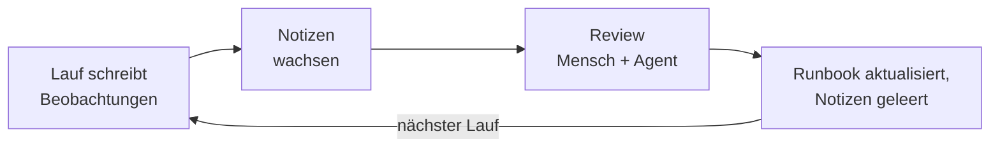
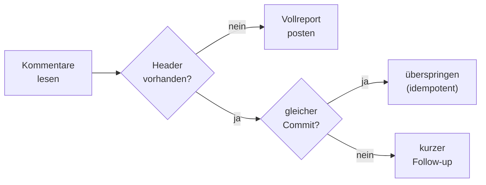

# Anatomie Autonomer Agenten

Wie ein Agent stündlich Tickets testet und täglich CVEs fixt — ohne Zuruf

<div class="text-sm opacity-75 mt-6">

Erfahrungen aus einem Produktivsystem: Testautomatisierung für eine Preis- & Antrags-API.
Der ganze Agent besteht aus **Markdown und einer Schleife** — Code gibt es nur in den Skills.

</div>

<!--
Anonymisierungs-Regeln für dieses Deck: keine Firmen-, Produkt-, Versicherer-
oder echten Ticket-Namen. Platzhalter: PROJ-1234, preis-service, generische
Domänenbegriffe. Zahlen (Zeilen, Frequenzen, Laufzeiten) sind reale
Größenordnungen aus dem Produktivsystem.
-->

---
layout: section
---

# 1. Nachts um drei

---
hideInToc: true
---

# Was heute Nacht passiert ist

<v-clicks>

- **23:07** — Lauf findet 3 offene Tickets; 2 sind zum aktuellen Commit schon getestet → **übersprungen**
- **00:07** — neuer Commit auf `PROJ-1234` → **kurzer Follow-up-Kommentar**: Regression weiterhin grün
- **02:07** — neues Ticket → **voller Testreport**, 3 Testfälle, alle IDs im Kommentar dokumentiert
- **06:00** — täglicher CVE-Lauf: neue Schwachstelle gemeldet → **Fix-PR** mit Versions-Bump erstellt
- **08:30** — ein **roter Befund** steht im Ticket — vorher vom Agenten unabhängig gegen den PR verifiziert

</v-clicks>

<div v-click class="mt-6">

<Callout tone="info">

**Kein Mensch war beteiligt.** Und fast noch interessanter: **kein Framework** — der ganze Agent ist Markdown.

</Callout>

</div>

<!--
Reale Größenordnungen: stündlicher Ticket-Test-Lauf, täglicher CVE-Lauf.
Die Punchline trägt die These des Vortrags: Autonomie ist kein
Framework-Problem, sondern ein Struktur-Problem.
-->

---
hideInToc: true
---

# Vom Chat-Agenten zum Dauerläufer

<style>
table {
  font-size: 0.9em;
}
</style>

| Fähigkeit        | Chat-Session              | Dauerläufer                  |
| ---------------- | ------------------------- | ---------------------------- |
| **Wiederanlauf** | Mensch startet jede Runde | Schleife startet — stündlich |
| **Gedächtnis**   | Kontextfenster, dann weg  | Ticketsystem, dauerhaft      |
| **Hände**        | eingebaute Tools          | Skills für die Domänen-APIs  |
| **Lernen**       | verpufft mit der Session  | Notizen → Runbook            |
| **Aufsicht**     | Mensch schaut live zu     | Eskalationsregeln + Kuration |

<div class="text-sm opacity-70 mt-4">

Die Bausteine dafür (u. a. `/loop`, Subagents) → <TalkXref slug="20260327-ai-agents" anchor="autonomie-primitive">AI Coding Agents</TalkXref>

</div>

---
hideInToc: true
---

# Inhalt

<Toc mode="all" minDepth="1" maxDepth="1" columns="2" listClass="!list-none !pl-0" />

---
layout: section
---

# 2. Die Anatomie im Überblick

---
hideInToc: true
---

# Sechs Organe, ein Kreislauf

<AnatomyDiagram class="mt-2" :highlight="[undefined, 'orchestrierung,runbook,skills,zustand', 'notizen', 'mensch'][$clicks]" />

<v-clicks>

- **Der Hauptfluss** — die **Orchestrierung** startet jeden Lauf mit frischem Kontext, das **Runbook** sagt was, die **Skills** tun es, der **Zustand** landet im Ticketsystem
- **Die Lern-Schleife** — **Notizen** halten Beobachtungen pro Lauf fest und fließen kuratiert zurück ins Runbook
- **Der Mensch** — Kurator der Notizen und letzte Instanz bei roten Befunden

</v-clicks>

---
layout: image
image: /anatomie-autonomer-agenten.webp
backgroundSize: contain
hideInToc: true
class: anatomie-poster
---

<AnatomyPosterDark />

---
hideInToc: true
---

# Orchestrierung: Dümmer ist besser

Variante 1 — Claude Code:

```text
/loop 1h Lies und befolge runbooks/ticket-test-runbook.md
```

Variante 2 — jeder beliebige CLI-Agent:

```bash
while true; do
  agent-cli "Lies und befolge runbooks/ticket-test-runbook.md"
  sleep 3600
done
```

<v-clicks>

- **Frischer Kontext pro Lauf** — kein Zustand im Prozess. Deshalb muss der Zustand woanders leben (→ Ticketsystem).
- **Harness-agnostisch** — dieselben Runbooks laufen mit Claude Code, Codex oder jedem anderen CLI-Agenten.

</v-clicks>

<Callout v-click tone="success" class="mt-3">

Kein Scheduler-Framework, kein Message-Bus, kein Orchestrator-Dienst — **eine Schleife reicht**.

</Callout>

---
hideInToc: true
---

# Der ganze Agent ist Markdown

<div class="grid grid-cols-2 gap-6 mt-2">

<div>

**Was wir gebaut haben**

- 2 Runbooks — **Markdown** (je ~50 KB)
- 2 Notiz-Dateien — **Markdown**
- 4 Skills — CLI-Wrapper, ~6 000 Zeilen Skripte (**der einzige Code**)
- 1 Schleife — `/loop` oder 3 Zeilen Shell

</div>

<div>

**Was wir _nicht_ gebaut haben**

- kein Agent-Framework, kein Orchestrator
- keine Hooks, keine Harness-Erweiterung
- keine Datenbank, kein State-Store
- kein Fine-Tuning, kein RAG-Stack

</div>

</div>

<Callout tone="info" class="mt-6">

**Standard-Harness ab Werk.** Die gesamte Fachlichkeit steht in Markdown — wer das Verhalten ändern will, editiert Text.

</Callout>

<!--
Kernbotschaft (Wunsch des Vortragenden): die Simplizität zeigen. Der Agent
ist kein System aus Code, sondern Text, den ein Standard-Harness ausführt.
Hooks/Automatisierung im Harness sind bewusst NICHT nötig.
-->

---
layout: section
routeAlias: runbooks
---

# 3. Runbooks — Programme in Prosa

<AnatomyDiagram mini highlight="runbook" class="mt-8" />

---
hideInToc: true
---

# Aufbau eines Runbooks

<div class="grid grid-cols-2 gap-6">

<div>

```text
# CVE-Scan-Runbook

## Werkzeuge
## Grundregeln
## Vorbereitung
## Schritt 1 … Schritt 5
## Bekannte Stolperfallen
## Verbesserungsnotizen pflegen
```

<div class="text-xs opacity-60 mt-2">

Je ~50–60 KB pures Markdown. Kein Code. Liegt in Git.

</div>

</div>

<div>

<v-clicks>

- **Werkzeuge** — was installiert sein muss, in welcher Reihenfolge
- **Grundregeln** — Sicherheits- und Betriebsregeln („nur Test-Hosts“)
- **Vorbereitung** — Ticketsuche (JQL), Scope-Filter, Credentials
- **Schritte** — fünf nummerierte Arbeitsschritte, teils mit Unterschritten (4.1 … 4.11)
- **Stolperfallen** — dokumentierte Überraschungen früherer Läufe
- **Notizen pflegen** — die Anweisung, Beobachtungen festzuhalten

</v-clicks>

</div>

</div>

---
hideInToc: true
---

# Prosa als versioniertes Programm

Das Runbook ist das Programm — **der Agent ist der Interpreter.**

<v-clicks>

- Instruktion ändern → Verhalten ändert sich beim nächsten Lauf. Kein Build, kein Deploy.
- Änderungen sind **Diff-reviewbar** wie Code — die Kuration committet direkt auf `main`; strikte PR-Pflicht gilt für die Ziel-Repos.
- Die Git-History des Runbooks ist die Lernkurve des Agenten:

</v-clicks>

<div v-click>

```text
a1b2c3d Notizen 22.06.–07.07. eingearbeitet, Notes geleert
e4f5a6b Follow-up-Kommentare: kurz statt Vollreport
9c8d7e6 Grundregel: externe IDs nie wiederverwenden
```

</div>

<Callout v-click tone="info" class="mt-3">

**Der Quelltext ist Deutsch.** Jeder im Team kann ihn lesen, reviewen und ändern — nicht nur Entwickler.

</Callout>

---
layout: section
routeAlias: notizen
---

# 4. Lernen durch Notizen

<AnatomyDiagram mini highlight="notizen" class="mt-8" />

---
hideInToc: true
---

# Der Agent schreibt mit

Jeder Lauf hängt Beobachtungen an eine git-getrackte Notiz-Datei an — die Anweisung dazu steht im Runbook selbst.

```markdown
### Lauf 2026-07-03 (PROJ-1234, PROJ-1240)

- **CLI-Stolperfalle:** `api-test preis` kürzt lange IDs in der
  Tabellenansicht → immer `--raw` verwenden. Beleg: Kommentar zu PROJ-1234.
- **Wiederkehrender Flake:** Endpoint liefert nach Deploy sporadisch 502
  beim ersten Aufruf → einmal wiederholen, erst dann als Fehler werten.
- **Lektion:** Prädikat X wird von zwei Mappern geteilt — bei Änderungen
  alle Verwendungen greppen. Beleg: Calc `b3f1c2d4-…`.
```

<Callout v-click tone="info" class="mt-3">

**Beobachtung ≠ Ergebnis.** Notizen halten das _Warum_ fest — mit Evidenz-IDs, damit die Lehre später überprüfbar bleibt.

</Callout>

---
hideInToc: true
---

# Der Kurations-Zyklus



<v-clicks>

- Etwa alle ein bis zwei Wochen liest ein Mensch die Notizen **gemeinsam mit einem Agenten**, generalisiert die Lehren und arbeitet sie ins Runbook ein — ein einziger Commit.
- Reale Größenordnung eines Kurations-Commits: Runbook **+300 Zeilen**, Notizen **−1100 Zeilen**.

</v-clicks>

<Callout v-click tone="warning" class="mt-3">

Der Agent arbeitet seine Notizen **nicht selbständig** ins Runbook ein — der Mensch bleibt Kurator. Absichtlich: Sonst driftet das Programm.

</Callout>

---
layout: section
routeAlias: idempotenz
---

# 5. Zustand — der Kommentar ist die Datenbank

<AnatomyDiagram mini highlight="zustand" class="mt-8" />

---
hideInToc: true
---

# Der Idempotenz-Header

Keine Datenbank, keine State-Machine — der Zustand lebt dort, wo ihn alle sehen: **im Ticket.**

Jeder Ergebnis-Kommentar beginnt mit einem stabilen, maschinenlesbaren Header:

```markdown
**Testautomatisierung** - Code-Stand `preis-service` `4f9c2ae`
```

<v-clicks>

- **Schritt 1 jedes Laufs:** alle Kommentare des Tickets lesen und nach diesem Header suchen.
- Der Commit-Hash im Header ist die **Prüfsumme der Arbeitseinheit**: gleicher Stand = schon erledigt.

</v-clicks>

<Callout v-click tone="info" class="mt-4">

**Der Kommentar IST der Zustand** — menschenlesbar und maschinenprüfbar zugleich.

</Callout>

---
hideInToc: true
---

# Entscheidungslogik pro Lauf



<Callout v-click tone="warning" class="mt-4">

**Stolperfalle:** Das Ticketsystem konvertiert Markdown in sein eigenes Markup (`**fett**` → `*fett*`, Backticks → `{{…}}`).
Der Idempotenz-Vergleich muss **tolerant auf die konvertierte Form** matchen — sonst testet der Agent jede Stunde neu.

</Callout>

<!--
Das ist die im Betrieb am härtesten erkämpfte Lektion dieser Sektion:
Der Header wird beim Posten transformiert, der naive String-Vergleich
schlägt fehl und die Idempotenz bricht still.
-->

---
hideInToc: true
---

# Audit-Anker: UUIDs & Live-Abfragen

<div class="grid grid-cols-2 gap-6 mt-2">

<div>

**IDs verankern jedes Ergebnis**

Jede Zeile im Ergebnis-Kommentar trägt ihre IDs:

`Calc b3f1c2d4-5e6f-4a7b-9c8d-0e1f2a3b4c5d`

- immer **vollständig**, nie gekürzt
- Jahre später noch in Logs und Data Warehouse auffindbar

</div>

<div>

**Live-Zustand statt Cache**

```bash
bb pr list --state open   # offene PRs
git ls-remote origin main # Branch-HEAD
api-test ping --base-url… # deployed?
```

<div class="text-xs opacity-60 mt-2">

Der Agent merkt sich nichts lokal — jeder Lauf erfragt die Welt neu. Konsequenz des frischen Kontexts.

</div>

</div>

</div>

---
layout: section
routeAlias: skills-mcp
---

# 6. Werkzeuge — Skills als Hände

<AnatomyDiagram mini highlight="skills" class="mt-8" />

---
hideInToc: true
---

# Vier Skills, drei Wörter pro Aufruf

<style>
table {
  font-size: 0.85em;
}
</style>

| Skill         | Wrappt                 | Versteckt                                     |
| ------------- | ---------------------- | --------------------------------------------- |
| `api-test`    | Preis-/Antrags-API     | Auth-Token-Handling, Schema-Validierung       |
| `jira-ticket` | Ticketsystem (REST v2) | Status-Übergänge, Attachments, exaktes Markup |
| `gbq`         | Data Warehouse         | Query-Auth **+ Kostendeckel**                 |
| `browser`     | Browser-Automation     | Session-Handling, Selektoren                  |

<v-clicks>

- **Muster:** Komplexität gehört ins Skript, nicht in den Prompt. Der Agent tippt `api-test preis …` — drei Wörter.
- Jeder Skill = `SKILL.md` (Anleitung) + Skripte — zusammen ~6 000 Zeilen Shell + Python. Testbar, reviewbar, versioniert.

</v-clicks>

<Callout v-click tone="info" class="mt-3">

Die Skills sind **der einzige Code im ganzen System** — nach außen drei Wörter, innen reguläre Skripte. Alles andere ist Markdown.

</Callout>

---
hideInToc: true
---

# Skills: drei Hebel

<div class="grid grid-cols-3 gap-5 mt-4">

<div>

**Kontext klein halten**

Das Skript **post-prozessiert**, bevor etwas im Kontext landet — filtern,
verdichten, formatieren. Die 5 000-Zeilen-Rohantwort bleibt draußen; nur das
verdichtete Ergebnis kommt rein.

</div>

<div>

**Häufiges & Komplexes kapseln**

Ein wiederkehrender Mehrschritt-Ablauf wird **ein Aufruf** — einmal geschrieben,
getestet, versioniert, statt bei jedem Lauf neu improvisiert.

</div>

<div>

**Security**

- **Geprüfter Code** im Skript statt Ad-hoc-Shell
- **Frontmatter** deklariert die erlaubten Utility-Tools
- erleichtert dem **Auto-Classifier** die Freigabe

</div>

</div>

<Callout tone="success" class="mt-5">

Und ein Skill ist schnell gebaut: `SKILL.md` + ein Skript — **kein Server, kein Protokoll wie bei MCP**. So bleibt der Agent seiner Natur treu: aus „nur ein Markdown" wird „**Markdown + eine Handvoll Skripte**".

</Callout>

<div class="text-sm opacity-70 mt-3">

Disclosure, Rechte & Auto-Classifier im Detail → <TalkXref slug="20260327-ai-agents" anchor="skills">Agent Skills — im Detail</TalkXref>

</div>

---
hideInToc: true
---

# Arbeitsteilung: Skill oder MCP?

<style>
table {
  font-size: 0.85em;
}
</style>

| Operation                    | Werkzeug | Warum                                  |
| ---------------------------- | -------- | -------------------------------------- |
| Ticket lesen                 | MCP      | funktioniert ab Werk                   |
| Kommentar mit exaktem Markup | Skill    | MCP wandelt Markdown eigenmächtig um   |
| Beliebige Status-Übergänge   | Skill    | MCP kennt nicht alle Transitions       |
| Datei anhängen               | Skill    | MCP sieht das lokale Dateisystem nicht |
| PRs auflisten                | Skill    | native CLI, bessere Filter             |

<v-clicks>

- **Faustregel:** MCP, wo es ab Werk reicht — Skills für die Lücken.
- Skills gewinnen auch ökonomisch: ~50 Token Frontmatter statt Tool-Definitionen bei jedem Request (Faktor 40–1100×) → <TalkXref slug="20260408-agents-details" anchor="token-oekonomie">Wie funktioniert ein Coding-Agent?</TalkXref>

</v-clicks>

---
layout: section
---

# 7. Die Anatomie im Einsatz

---
hideInToc: true
---

# Use Case 1: Stündliches Ticket-Testen

<v-clicks>

1. **Zustand lesen** — Kommentare holen, Idempotenz-Check: schon getestet? welcher Commit?
2. **Kontext sammeln** — PR, Repo und Code-Änderungen zum Ticket finden
3. **Testplan erstellen** — Testfälle `TC1…TCn` als Tabelle, vorab nachvollziehbar
4. **Umgebung prüfen** — Snapshot deployed? Sonst auf Staging ausweichen
5. **Ausführen** — **jedes Ticket in einem eigenen Subagenten**: isoliertes Kontextfenster, nur das strukturierte Ergebnis kommt zurück
6. **Dokumentieren** — der Orchestrator postet die Ergebnis-Kommentare mit Header + IDs; Beobachtungen wandern in die Notizen

</v-clicks>

<div class="text-sm opacity-70 mt-4">

Subagents als Autonomie-Primitiv → <TalkXref slug="20260327-ai-agents" anchor="autonomie-primitive">AI Coding Agents</TalkXref>

</div>

---
hideInToc: true
---

# Anatomie eines Ergebnis-Kommentars

<div class="border rounded p-3 text-sm" style="border: 0.5px solid var(--color-border-tertiary); background: var(--color-background-secondary);">

**Testautomatisierung** - Code-Stand `preis-service` `4f9c2ae`

| Testfall                    | Status | Beobachtet                                 |
| --------------------------- | ------ | ------------------------------------------ |
| TC1 Bonitätsablehnung       | ✅     | Ablehnung wie erwartet — Calc `b3f1c2d4-…` |
| TC2 Preis-Regression        | ✅     | Preis unverändert — Calc `a1b2c3d4-…`      |
| TC3 Sonderfall Fahranfänger | ❌     | Aufschlag fehlt — Calc `c9d8e7f6-…`        |

<span class="text-xs opacity-60">Details & Logs im Anhang · IDs hier gekürzt — im echten Kommentar immer vollständig</span>

</div>

<Callout v-click tone="danger" class="mt-4">

**Der Agent prüft rote Befunde immer gegen, bevor er sie postet** — er liest den PR-Diff unabhängig, statt der Commit-Message zu glauben. Ein Fehlalarm im Ticket kostet mehr Vertrauen, als zehn grüne Reports aufbauen.

</Callout>

<style>
table {
  font-size: 0.8em;
}
</style>

---
hideInToc: true
---

# Use Case 2: Tägliches CVE-Fixen

<div class="grid grid-cols-2 gap-6 mt-2">

<div>

**Gleich geblieben**

- Orchestrierung: dieselbe Schleife, täglich statt stündlich
- Idempotenz: Scan-Status je Repo & CVE-Welle
- Notizen + wöchentliche Kuration
- Mensch als Gate — hier: der Merge

</div>

<div>

**Anders**

- eigenes Runbook: Scan → Version-Bump → Build → PR
- anderer Skill-Mix: Scanner + Build statt Test-API
- Ergebnis ist ein **eigener PR** — fremde PRs werden nie angefasst

</div>

</div>

<v-clicks>

- Transiente Fehler (Auth-403, API-401) → **Retry statt Abbruch**; echte Fehler führen zum Abbruch.
- Bekannte, noch nicht fixbare CVEs landen in einer Status-Datei und werden **täglich erneut geprüft**, bis eine Fix-Version erscheint.

</v-clicks>

---
hideInToc: true
---

# Gleiche Anatomie, neuer Use Case

<style>
table {
  font-size: 0.85em;
}
</style>

| Use Case                   | Runbook sagt …                     | Skills              | Zustand lebt in …       |
| -------------------------- | ---------------------------------- | ------------------- | ----------------------- |
| Ticket-Tests _(produktiv)_ | „teste die Änderungen am Ticket“   | API, Ticketsystem   | Ticket-Kommentar        |
| CVE-Fixes _(produktiv)_    | „scanne & fixe Abhängigkeiten“     | Scanner, Build, PR  | Status-Datei + PRs      |
| Code-Review _(Ausblick)_   | „prüfe offene PRs nach Checkliste“ | Diff, PR-Kommentare | PR-Kommentar mit Header |
| Alert-Analyse _(Ausblick)_ | „trianguliere neue Alerts“         | Monitoring, Logs    | Alert-Ticket            |

<Callout v-click tone="success" class="mt-4">

Es ändern sich nur **Runbook + Skills**. Orchestrierung, Idempotenz-Muster, Notizen und menschliche Kuration bleiben identisch — die Anatomie ist der wiederverwendbare Teil.

</Callout>

---
layout: section
---

# 8. Leitplanken & Grenzen

<AnatomyDiagram mini highlight="mensch" class="mt-8" />

---
hideInToc: true
---

# Leitplanken

<v-clicks>

- **Gestaffelte Sperren** — die gefährlichste Operation (Anträge gegen Produktion) blockt das Skill _technisch_; die Nur-Test-Hosts-Regel steht im Runbook
- **Repo-Scoping** — der Agent testet nur Änderungen aus explizit definierten Repositories
- **Rote Befunde** — erst nach unabhängiger Gegenprüfung ins Ticket: Diff lesen, nie der Commit-Message glauben
- **Fremdes bleibt fremd** — eigene Branches und PRs statt fremde zu verändern
- **Retries nur für Transientes** — Auth-Hiccups ja, echte Fehler nein

</v-clicks>

<div class="text-sm opacity-70 mt-4">

Was der Harness zusätzlich absichert (Permission-Modes, Sandbox) → <TalkXref slug="20260327-ai-agents" anchor="permission-modes">AI Coding Agents</TalkXref>

</div>

---
hideInToc: true
---

# Was (noch) nicht geht

<v-clicks>

- **Kein Selbst-Lernen** — für autonome Runbook-Änderungen fehlt das Sicherheitsnetz (etwa eine Eval-Suite für Runbooks); bis dahin bleibt Kuration Handarbeit.
- **Flaky-Befunde** — ob Rot ein echter Defekt oder ein Umgebungsproblem ist, braucht weiterhin menschliches Urteil.
- **Markup-Konvertierung** — das tolerante Idempotenz-Matching bleibt die fummeligste Stelle des Systems.
- **Kontextkosten** — ~50 KB Runbook werden jedem Lauf neu vorgelegt; das Runbook wächst mit jeder Kuration.

</v-clicks>

<Callout v-click tone="warning" class="mt-4">

Autonomie heißt hier: **unbeaufsichtigt zwischen den Checkpoints** — nicht unbeaufsichtigt insgesamt.

</Callout>

---
hideInToc: true
---

# Takeaways

<v-clicks>

1. **Das Runbook ist ein Programm** — in Prosa, versioniert, reviewbar. Der Agent ist nur der Interpreter.
2. **Zustand gehört ins Ticketsystem** — der Idempotenz-Header macht jeden Lauf gefahrlos wiederholbar.
3. **Lernen = Agent notiert, Mensch kuratiert** — die Git-History des Runbooks ist die Lernkurve.
4. **Der einzige Code sind die Skills** — Standard-Harness + Markdown + eine Schleife. Keine Hooks, kein Framework.

</v-clicks>

---
hideInToc: true
---

# Zum Weiterlesen

<TalkXrefPanel
  :here="{
    title: 'Anatomie Autonomer Agenten',
    bullets: [
      'Runbooks als <strong>Programme in Prosa</strong>',
      'Idempotenz-Header: <strong>der Kommentar ist der Zustand</strong>',
      'Lernen durch <strong>Notizen + menschliche Kuration</strong>',
    ],
  }"
  :refs="[
    {
      slug: '20260327-ai-agents',
      anchor: 'autonomie-primitive',
      bullets: [
        'Autonomie-Primitive: <code>/loop</code>, <code>/goal</code>, Subagents, Dynamic Workflows',
        'Permission-Modes & Sandboxing',
      ],
    },
    {
      slug: '20260408-agents-details',
      anchor: 'token-oekonomie',
      bullets: [
        'Token-Ökonomie: Skills vs. MCP (Faktor 40–1100×)',
        'Kontextfenster, Caching, Subagent-Kosten',
      ],
    },
  ]"
/>

---
layout: end
hideInToc: true
---

# Danke

Fragen?
