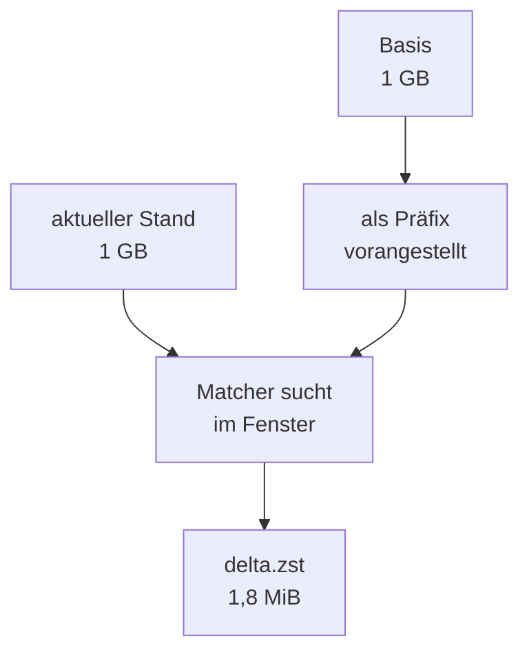

# Snapshots ohne Dateisystem-Magie

Von btrfs und ZFS zu `zstd --patch-from`

<!--
0:00–0:20 · Aufhänger, während nur der Titel steht:

„Eine Datei. Ein Gigabyte. Sie ändert sich alle fünfzehn Minuten, mittendrin.
Gesichert wird sie einmal am Tag — sechsundneunzig Stände entstehen, einer
wird aufgehoben, fünfundneunzig existieren nirgends mehr. Wenn Sie jetzt
‚Snapshot' denken, denken Sie genau das Richtige. Ich zeige Ihnen in acht
Minuten, warum es hier trotzdem nicht geht — und was stattdessen
funktioniert. Es ist ein Kommandozeilenwerkzeug, das die meisten von Ihnen
schon installiert haben."

Farbschema: hell. Falls der Saal dunkel ist, im Präsentationsmodus umstellen.
-->

---
hideInToc: true
---

# 96 zu 1

<div class="text-lg mb-4">

Ein Automat schreibt die Datei, Menschen an ihren Rechnern lesen sie — und
dazwischen liegt ein Speicher, der keinem von beiden gehört.

</div>

<div class="grid grid-cols-2 gap-6">
<div>

**Der Zustand**

- eine Datenbankdatei, rund **1 GB**
- alle **15 Minuten** ändert sie sich mittendrin
- gesichert wird sie **einmal am Tag**

**96 Stände am Tag, einer wird aufgehoben.**
Die anderen 95 existieren nirgends mehr. Wer einen davon
braucht, rechnet ihn neu — jedes Mal.

</div>
<div v-click>

**Vier Budgets, die die Lösung einengen**

- **Zeit** — ein Lauf hat Minuten, kein Gigabyte-Fenster
- **Größe** — der Speicher räumt nach 30 Tagen auf
- **Speicher** — der Rechner, der es baut, ist klein
- **Format** — ein Restore muss **ohne unseren Code** gelingen

</div>
</div>

<div v-click class="mt-4">

<Callout tone="info">
Gesucht ist nicht das beste Delta-Verfahren, sondern das, das diese vier Budgets überlebt.
Auf der übernächsten Folie stirbt jeder Kandidat an genau einem davon.
</Callout>

</div>

<!--
0:20–1:00 · Der Rollensatz oben trägt alles Weitere: Automat schreibt,
Menschen lesen, Speicher gehört keinem. Die vier Budgets sind die Achsen,
an denen später jeder Kandidat scheitert. Keine Geldbeträge nennen — die
Größenordnung genügt: eine Neuberechnung kostet je Anfrage im Cent-Bereich,
und davon fallen viele an.
-->

---
hideInToc: true
---

# Die Antwort, die alle zuerst geben

Copy-on-Write kann das doch längst.

<div class="grid grid-cols-2 gap-x-8 gap-y-3 mt-4 text-sm">
<div v-click>

**btrfs** — `btrfs send -p alt neu`

Blockgenauer Strom gegen einen Vorgänger-Snapshot.

</div>
<div v-click>

**ZFS** — `zfs send -i alt@snap neu@snap`

Dasselbe Prinzip, ausgereifter, mit Pool dahinter.

</div>
<div v-click>

**LVM-Thin** — `thin_delta`

Vergleicht zwei Thin-Volumes auf Blockebene.

</div>
<div v-click>

**APFS** — `fs_snapshot`, `mount_apfs -s`

Anlegen, auflisten, einhängen, zurückrollen — sechs Verben.

</div>
</div>

<div v-click class="mt-6 text-center text-lg">

Das ist die richtige Antwort. Wer sie gegeben hätte: Hand hoch.

</div>

<!--
1:00–1:40 · Hier soll das Publikum nicken, und zwar zu Recht — der Bruch
kommt erst auf der nächsten Folie. Handzeichen einholen, das ist der einzige
Schnitt, der spontan mitten im Vortrag geht.

Belegt: btrfs-send(8) und zfs-send(8) für die Inkrement-Flags; thin_delta(8);
sys/snapshot.h im macOS-SDK 26.5 listet genau sechs Verben (create, list,
delete, rename, mount, revert), mount_apfs(8) hängt einen Snapshot ein.
Nicht behaupten, APFS könne „kein send" — belegbar ist nur, dass es kein
Stream-Format gibt.
-->

---
hideInToc: true
---

# Und jetzt?

<div class="mt-6">

```bash
zfs send -i @gestern pool/db > delta.zfs
```

</div>

<div v-click class="mt-6">

Eine Datei ist das schon. Nur macht sie **ausschließlich dasselbe Dateisystem** wieder auf.

</div>

<div v-click class="mt-6">

<Callout tone="warning">
Der Automat läuft in einem Container: <code>btrfs send</code> verlangt <code>CAP_SYS_ADMIN</code> im
<strong>initialen</strong> User-Namespace — Root im Container ist dort kein Root. Die Lesenden sitzen auf macOS:
ZFS gibt es dort als Port, aber niemand installiert für ein Backup eine Kernel-Erweiterung und legt einen Pool an.
Und das Ziel ist ein Object Store: der nimmt Dateien, keine Ströme.
</Callout>

</div>

<div v-click class="mt-4 text-center text-lg">

Gesucht ist dieselbe Idee **eine Ebene höher**: Copy-on-Write auf Dateiebene.

</div>

<!--
1:40–2:15 · Der Bruch. Wichtig: nicht behaupten, ZFS gäbe es auf macOS
nicht — es gibt einen gepflegten Port mit Paketen bis macOS 26. Das
Argument ist die Zumutung, nicht die Verfügbarkeit.

Das Container-Argument trägt überall: Linux fs/btrfs/send.c prüft
CAP_SYS_ADMIN, und capable() prüft gegen den initialen User-Namespace.
Der btrfs-Treiber in Docker und Podman existiert sehr wohl — deshalb nicht
mit „overlayfs" argumentieren.

Log-Shipping, falls jemand fragt: DuckDBs WAL ist Absturzwiederherstellung,
kein Transportformat — sie wird beim sauberen Beenden gelöscht.
-->

---
clicks: 1
hideInToc: true
routeAlias: frage-rdiff
---

# Schätzfrage: rsync kann das doch

<div class="text-sm opacity-75 mb-3">

Zwei Stände der Datei. Geändert haben sich <strong>11,8 KB</strong> Nutzdaten.
Wie groß wird das Delta, das <code>rdiff</code> daraus baut?

</div>

<GuessReveal
  :clicks="$clicks"
  question="rdiff, also librsync — die Technik hinter rsync"
  :options="[{ label: '12 KB' }, { label: '300 KB' }, { label: '3 MiB' }, { label: '30 MiB' }]"
  :answer-index="2"
  :reveal="{
    number: 3.23,
    unit: 'MiB',
    note: 'Was die Basis nicht als ganzen Block wiederfindet, geht roh hinaus: das Delta-Format kennt kein Kompressionsfeld. In dieser Messung war das praktisch das ganze Dateiwachstum.',
  }"
/>

<!--
2:15–2:55 · Kurz raten lassen, Hände hoch. Aufgelöst wird mit der
Weiter-Taste.

Genau formuliert: Ein rdiff-Delta kann nicht kleiner werden als die Bytes,
die in der Basis keinen ganzen Block wiederfinden — die gehen als LITERAL
roh hinaus (librsync doc/formats.md; src/rdiff.c sagt „compression is not
implemented yet"). Eine Untergrenze „gleich dem Wachstum" gibt es NICHT:
COPY darf an jeder Stelle der Basis abschreiben. Die Messung hier lag nur
zufällig fast genau auf dem Wachstum.

Falls jemand `rsync --only-write-batch` ruft: Ja, das schreibt ein Delta in
eine Datei — zwingt aber auf zlib und verlangt drüben einen identischen
Zielbaum.
-->

---
hideInToc: true
---

# Vier Kandidaten, vier Budgets

<div class="text-sm">

| Kandidat         | Delta    | Zeit  | Speicher                               | Gescheitert am Budget                                           |
| ---------------- | -------- | ----- | -------------------------------------- | --------------------------------------------------------------- |
| rdiff / librsync | 3,23 MiB | —     | —                                      | **Größe** — Literale gehen roh hinaus                           |
| bsdiff           | 47,5 KB  | 150 s | <span v-mark.circle="1">9,16 GB</span> | **Speicher** — das Neunzehnfache der Datei                      |
| xdelta3          | 41–47 KB | 2,6 s | ok                                     | **Format** — als Kette 97 Objekte je Tag, ein Loch bricht alles |
| Zeilen-Export    | 11,8 KB  | —     | —                                      | **Format** — nicht byteidentisch, Löschungen fehlen             |

</div>

<div v-click class="mt-5">

<Callout tone="danger">
<strong>par2 löst ein anderes Problem.</strong> Es ist Fehlerkorrektur, kein Delta — es spart kein einziges
Byte Übertragung, sondern legte bei dieser Datei 24,9 MiB obendrauf.
</Callout>

</div>

<div v-click class="mt-3 text-sm opacity-75">

Und der beste von ihnen braucht auf jedem Rechner, der wiederherstellen will, ein eigenes Werkzeug.

</div>

<!--
2:55–3:35 · Tempo machen, je Zeile ein Satz. Die Tabelle ist zum Anschauen,
nicht zum Vorlesen. Der v-mark auf 9,16 GB ist der Ersatz für die gestrichene
Schätzfrage.

Nicht sagen „keiner kommt als fertiges Wheel": bsdiff4 1.2.6 hat sehr wohl
cp313-Räder (PyPI, 19.02.2025). Für xdelta3 stimmt es (0.0.5 von 2017).
Das tragfähige Argument gegen bsdiff ist allein die Speicherlast.

par2: die 24,9 MiB sind eine eigene Messung an dieser Datei. Die oft
genannten „fünf Prozent" sind eine Einstellung, keine Eigenschaft.

Falls jemand nach casync, restic oder borg fragt: nicht untersucht, ehrlich
sagen. Ebenso brotli mit rohem Wörterbuch.
-->

---
clicks: false
hideInToc: true
routeAlias: restore-punkte
---

# Kette oder Differenz?

<RestorePointTimeline />

<div class="mt-3 text-sm opacity-75">

Inkrementell heißt: gegen das letzte Backup, egal welcher Art. Differenziell heißt: gegen das letzte
Vollbackup — deshalb reichen zum Zurückholen zwei Objekte.

</div>

<!--
3:35–4:15 · Erst Kette, einen späten Punkt wählen: viele Objekte. Dann ein
Objekt löschen — alles danach ist rot und trägt ein Kreuz. Dann auf Differenz
umschalten und dasselbe Löschen wiederholen: genau ein Punkt fällt aus.

Begriffe nach NIST SP 800-34 Rev. 1, §5.1.2. Die 96 Zyklen am Tag und die
Objektzahl in der Kette nie in einem Satz mischen — das verwirrt.

Überleitung: Und wer rechnet mir alle 15 Minuten ein Delta gegen ein
Gigabyte, ohne den Rechner umzubringen?
-->

---
hideInToc: true
---

# `zstd --patch-from`

<div class="grid grid-cols-2 gap-6 mt-2">
<div>

```bash
# Delta bauen
zstd -3 --single-thread \
     --patch-from=basis.duckdb \
     aktuell.duckdb -o delta.zst

# und zurück
zstd -d --long=30 \
     --patch-from=basis.duckdb \
     delta.zst -o aktuell.duckdb
```

<div class="mt-3 text-sm">

- die Basis wird als **Präfix** vorangestellt
- das Fenster wird **größer als die Datei**
- heraus fällt ein **gewöhnlicher zstd-Frame**

</div>

</div>
<div>



</div>
</div>

<div v-click class="mt-3">

<Callout tone="success">
Ein geänderter Block landet in DuckDB nicht am alten Offset — die Copy-on-Write-Idee steckt schon im
Dateiformat. Deshalb funktioniert ein Byte-Delta überhaupt.
</Callout>

</div>

<!--
4:15–5:00 · Die beiden Zeilen sind der Kern des Vortrags.

Zwei Flags, die man nicht weglassen darf, beide gemessen:
- `--single-thread` beim Bauen: seit zstd 1.5.7 ist Multithreading
  CLI-Default, und ein MT-Delta war in drei Messungen bis zu 5,4-mal so groß.
  `-T1` genügt nicht.
- `--long=30` beim Entpacken: ohne das bricht zstd mit „Frame requires too
  much memory for decoding" ab. Beim Bauen setzt `--patch-from` das Fenster
  selbst, beim Entpacken hebt es das Limit nur auf die Basisgröße.

`--patch-from` gibt es seit zstd 1.4.5 (2020); 1.5.7 ist der aktuelle Stand.
Warum nicht `-D`: das verweigert jede Wörterbuchdatei über 32 MiB.
-->

---
clicks: 1
hideInToc: true
routeAlias: frage-bibliothek
---

# Dieselbe Bibliothek, andere Anbindung

<div class="text-sm opacity-75 mb-3">

Gleiche libzstd, gleiche Dateien, gleiche Einstellungen — nur der Weg, auf dem die Basis hineinkommt,
ist ein anderer. Statt 1,8 MiB kam heraus:

</div>

<GuessReveal
  :clicks="$clicks"
  question="Wie groß wurde das Delta über die andere Anbindung?"
  :options="[{ label: '465 MiB' }, { label: '111 MiB' }, { label: '18 MiB' }, { label: '1,8 MiB' }]"
  :answer-index="1"
  :reveal="{
    number: 111,
    unit: 'MiB',
    decimals: 0,
    note: 'Der Faktor 60 kam ohne Fehlermeldung. Die Basis war da — sie wurde nur über einen Weg geladen, auf dem der Long-Distance-Matcher sie nie zu sehen bekommt.',
  }"
/>

<div class="mt-4 text-xs opacity-60">

Beides steht im selben Header, 26 Zeilen auseinander: `zstd.h:1104` rät von dem einen Weg ab,
`zstd.h:1128` beschreibt den anderen als LDM-tauglich.

</div>

<!--
5:00–5:40 · Die Lehre des Vortrags. Ein zu großes Delta meldet sich nicht.
Es sieht aus wie ein Delta.

Genau formuliert: Nicht das Wörterbuch entscheidet, sondern der Ladeweg.
`ZSTD_CCtx_loadDictionary` baut ein CDict ohne Kompressionsstufe, und das
nimmt immer den Attach-Pfad — dort füllt niemand die LDM-Tabelle.
`ZSTD_CCtx_refPrefix` geht über den Pfad, der sie füllt.
NICHT sagen „der LDM indiziert CDicts nie" — als allgemeines Gesetz ist das
falsch, zstd.h:1128 sagt ausdrücklich das Gegenteil für den anderen Weg.

Schlusspointe hier schon andeuten: wir hatten die Bibliothek benutzt, statt
sie zu lesen.
-->

---
clicks: false
hideInToc: true
---

# Die Zahlen

<DeltaSizeBars />

<!--
5:40–6:10 · Durch die Reiter klicken. Jeder trägt Datum und
Werkzeugversion in der Fußzeile — das ist Absicht, die Zahlen stammen aus
je einer Messung an je einer Datei.

Beim letzten Reiter sagen: dieselbe Falle lässt sich hier auf der Bühne
vorführen.
-->

---
clicks: false
hideInToc: true
routeAlias: notweg
---

# Live: ein Delta, hier im Browser

<PatchFromDemo />

<!--
6:10–6:50 · Schieberegler bewegen. Dann auf „Stufe 3" umschalten: das Delta
springt um mehr als das Zwanzigfache, ohne Fehler, ohne Warnung. Zurück auf
Stufe 9 und die SHA-256-Prüfung laufen lassen.

Warum zwei Deckel: Bei Stufe 3 begrenzt das Fenster (2 MiB) das Ziel, und
ein zweiter Deckel begrenzt, wie viel vom Präfix überhaupt indiziert wird.
Die Kommandozeile setzt beide selbst — deshalb hat sie das Problem nicht.

Warum trotzdem SHA-256 im Manifest: Fehlt die Basis, bricht zstd ab. Eine
FALSCHE Basis gleicher Länge fängt nur die Frame-Prüfsumme — und die ist in
libzstd voreingestellt AUS. Der SHA-256 ist nicht Gürtel und Hosenträger,
er ist der Hosenträger.

Wenn die Demo klemmt: die zwei Zeilen auf Folie 8 sind der eigentliche
Liefergegenstand, einfach dorthin zurückblättern.
-->

---
hideInToc: true
---

# Was ich mitnehme

<div class="text-lg space-y-3 mt-4">

<div v-click><strong>1 · Ein Standardformat schlägt das bessere Eigenbau-Delta.</strong> Der eigene Diff war fertig — und ohne unseren Code nicht lesbar.</div>

<div v-click><strong>2 · Nicht der Algorithmus entscheidet, sondern die Anbindung.</strong> Faktor 60 zwischen zwei Wegen zu derselben C-Bibliothek.</div>

<div v-click><strong>3 · Differenziell statt inkrementell</strong>, sobald der Speicher selbst aufräumt. Zwei Objekte je Punkt, keine Kette.</div>

<div v-click><strong>4 · Ein Delta ist nicht selbsttragend.</strong> Es trägt keine Kennung seiner Basis — die Zuordnung ist unsere Aufgabe.</div>

<div v-click><strong>5 · Ein zu großes Delta meldet sich nie von selbst.</strong> Nur die Messung sieht es.</div>

</div>

<!--
6:50–7:30 · Fünf Zeilen, eine je Klick.

Schlusssatz wörtlich:
„Die Frage, die mich hierher gebracht hat, hieß am Ende nicht ‚welcher
Algorithmus ist der beste?', sondern ‚wer stellt das in drei Jahren ohne
meinen Code wieder her?'. Die ganze Antwort passt in eine Zeile:
zstd -d --long=30 --patch-from=basis delta.zst -o datenbank.duckdb.
Und die Falle davor stand die ganze Zeit im Header, zwei Notizen
voneinander entfernt — wir hatten die Bibliothek benutzt, statt sie zu
lesen."

Danach 30 s Puffer. Wird verbraucht oder nicht.
-->

---
layout: end
hideInToc: true
---

# Danke

<div class="text-sm opacity-75 mt-4">

zstd(1) zu `--patch-from` · RFC 8878 · btrfs-send(8) · NIST SP 800-34 Rev. 1

</div>

---
hideInToc: true
routeAlias: anhang
---

# Anhang: was noch dazugehört

<div class="grid grid-cols-2 gap-6 text-sm mt-4">
<div>

**Damit zwei Schreiber sich nicht ins Gehege kommen**

- ein **Manifest** als einzige Wahrheit, optimistisch gesperrt über eine
  Precondition auf die Objektversion
- Objektnamen sind **unveränderlich**: Inhalt im Namen
- ein **Katalog** je Tag hält die Wiederherstellungspunkte
- eine **Schreibsperre** gegen zwei gleichzeitige Schreiber

</div>
<div>

**Grenzen des Verfahrens**

- Delta größer als **25 %** des Vollbackups → neues Vollbackup
- `--patch-from` bricht ab, sobald Basis oder Ziel über **2 GiB** liegen
- der Publisher braucht **Basis plus Fenster** an Speicher
- die Basis bleibt lokal liegen: **+1 GB** Platte

</div>
</div>

<div class="mt-6 text-sm opacity-75">

Warum ausgerechnet 25 %: DuckDB führt Row-Groups zusammen, sobald in benachbarten Gruppen etwa ein
Viertel der Zeilen gelöscht ist, und räumt den Index auf, sobald ein Zehntel der Puffer frei ist.
Beides schreibt große Teile der Datei neu — der Ausreißer ist eingeplant, nicht überraschend.

</div>

<!--
Nur für Rückfragen. Nicht im Zeitbudget. Anspringbar über den routeAlias.
-->
